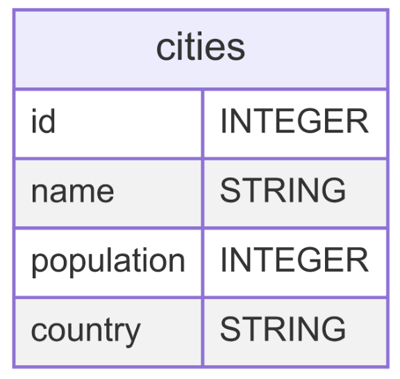

# Assignment #5 - SQL

**TASK**: Create a world_cities database that stores a cities id, name, population, and country in a cities table. 



You will add the following values to the database

| Name | Population | Country |
| -----| ---------- | ------- |
| New York | 8,398,748 | United States |
| Tokyo | 13,515,271 | Japan |
| Cairo | 9,500,000 | Egypt |
| Sydney | 5,312,163 | Australia | 
| São Paulo | 12,252,023 | Brazil |
| Paris | 2,140,526 | France |
| Lagos | 14,368,332 | Nigeria |
| Mumbai | 12,442,373 | India |
| Osaka | 2,752,123 | Japan |
| Beijing | 21,542,000 | China |

Once you have these 10 items in the database, you will query the database using SQL in order to print out and update information stored in your cities in your table.

After you have verified that the table has been created with these values, you need to do the following:
- Updated Bejing's population to 19,400,000
- Delete the rows that contain New York, Paris, and Cairo. 

## Grading Your Work
This assignment can grade itself! To setup the autograding, you should do the following:
1. Clone this file to your local machine using the command
```bash
git clone PASTE_URL_HERE
```
2. Open the downloaded file in your VS Code editor.
3. In the left hand sidebar, press the "Testing" menu represented by the picture of a flask.
4. Click "Configure Python Tests".
5. You'll have two options to select. Select **pytest**.
6. Select the folder where the tests live. You can simply select `. Root directory`.
7. You can now run the tests by pressing the play icon. A passing test will get a ✅ and a failing test will get a ❌.
8. Run the tests as you code and by the end it should be all ✅ if you have followed the specifications for this assignment!

## Unit Tests

The tests expect a table of cities that was provided above. In addition to checking the values in the table, it is checking that you have updated and deleted the values specified in the directions for the assignment. 

> **IMPORTANT**: If you have not run the `world_cities.sql` file before running your tests, then the tests may fail even if your code is correct because the database has not been updated. As such, make sure to run the command `world_cities.db < world_cities.sql` before running your tests any time you update your code.

### Unit Test Explanations
- `test_cities_table_exists`: Verifies that the cities table exists in the database.
- `test_cities_table_columns`: Checks that the cities table has the 4 columns (id, name, population, country) and that they are in the correct order.
- `test_beijing_population_update`: Tests that Bejing's population was updated to the correct value (19,400,000).
- `test_deleted_cities`: Tests that the specified cities (New York, Paris, and Cairo) were deleted from the table.
- `test_final_cities_count`: Checks that the final table has 7 values.
- `test_remaining_cities`: Checks that the 7 remaining cities have the correct values.
